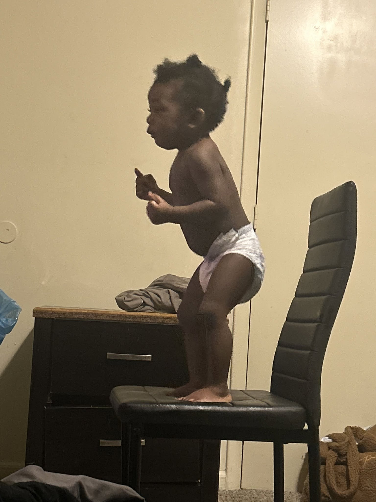
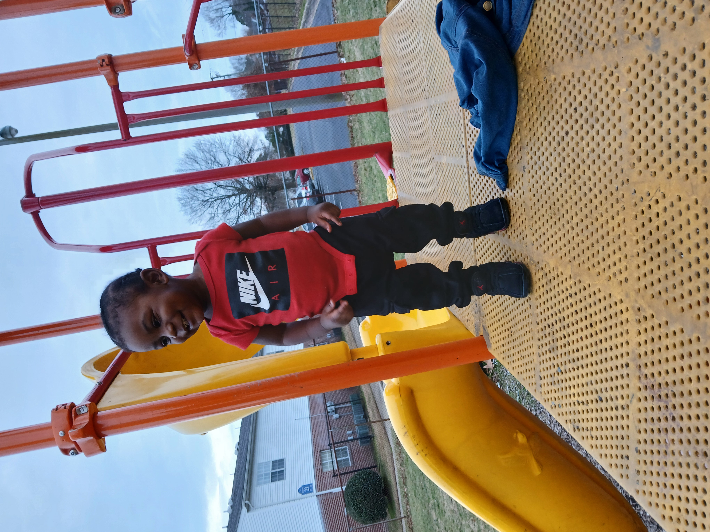
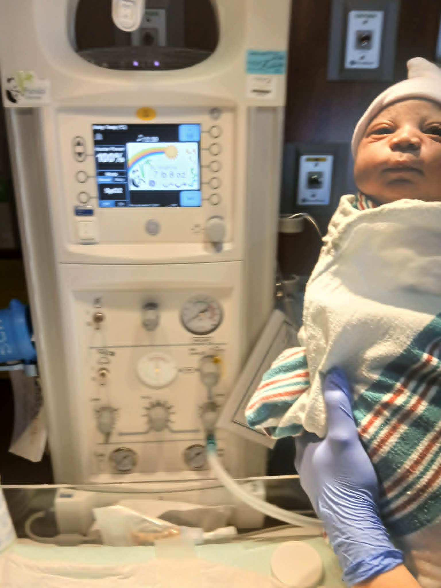

<!DOCTYPE html>
<html lang="en">
<head>
  <meta charset="UTF-8">
  <meta name="viewport" content="width=device-width, initial-scale=1.0">
  <title>A Child of God Kasir Robinson</title>

  
</head>

<body>

  <header>
    

    <h1>A Child of God Kasir Robinson</h1>
    
Blessed, loved, protected, and created with purpose.

  </header>

  <section class="gallery">

    

      
      
Your smile is a reminder of God’s love, joy, and the beauty of innocence.

    

    

      
      
You were created with purpose, covered by grace, and surrounded by love.

    

    

      
      
Every step you take is guided by God’s hands and protected by His promises.

    

    

      
      
You are strong, special, and wonderfully made, a true child of God.

    

    

      
      
Kasir Robinson, may your life always be filled with faith, love, peace, and blessings.

    

    

      
      
A precious gift from heaven, loved beyond words and blessed beyond measure.

    

    

      
      
Your life is a beautiful blessing, and your future is filled with God’s purpose.

    

    

      
      
God made you special, unique, and full of light that shines everywhere you go.

    

  </section>

  <footer>
    
Made with love for Kasir Robinson

  </footer>

</body>
</html>
